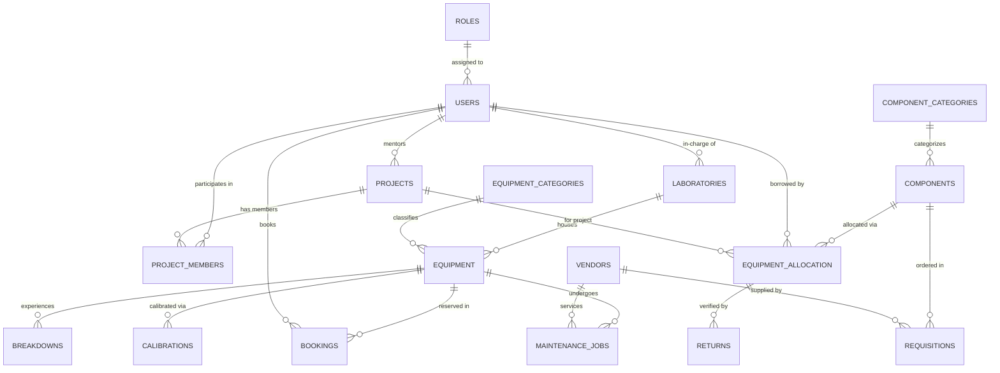

# RoboLab — Robotics Lab Management System

[](LICENSE)
[](https://www.python.org/)
[](https://palletsprojects.com/p/flask/)
[](database/)

**RoboLab** is a web-based lab management system built with Python Flask for a DBMS Project-Based Learning (PBL) assignment. It helps manage everything in a robotics lab — from tracking machines and components to handling student bookings, maintenance jobs, and calibration schedules.

The app runs on MySQL for a proper setup, but automatically falls back to a pre-seeded SQLite database if MySQL isn't configured — so you can run it instantly without any database setup.

---

## Table of Contents

1. [What It Does](#what-it-does)
2. [Who Uses It (Roles)](#who-uses-it-roles)
3. [How to Run It](#how-to-run-it)
4. [Tech Stack](#tech-stack)
5. [Database Design](#database-design)
6. [SQL Triggers Explained](#sql-triggers-explained)
7. [Project Structure](#project-structure)
8. [Changelog](#changelog)
9. [License](#license)

---

## What It Does

RoboLab covers the full workflow of running a university robotics laboratory:

### Equipment Management
Track all lab machines (robotic arms, 3D printers, CNC routers, oscilloscopes, etc.). Each piece of equipment has:
- A status: `Available`, `In Use`, `Maintenance`, or `Decommissioned`
- A location (lab room + workstation)
- Serial number, purchase date, category
- A **timeline view** showing its entire history — every booking, breakdown, and service job logged chronologically

### Component Inventory
Manage smaller hardware items (sensors, microcontrollers, motors, etc.) stored in physical bins. The system tracks:
- Total quantity vs available quantity vs minimum safety threshold
- Low-stock warnings when stock falls below the minimum
- Bin and rack location for physical retrieval

### Component Allocation (Issuing & Returns)
Students borrow components for their projects. The system:
1. Issues components to a student, linked to their project
2. Sets a due date for return
3. Flags overdue items
4. On return, checks the condition (`Good`, `Damaged`, `Burnt`, `Lost`)
5. Automatically updates available stock via a SQL trigger — only restores usable items

### Equipment Bookings
Students book time slots for shared machines. The booking goes through stages:
```
Pending → Approved → In Use → Returned
                  ↘ Cancelled
```
Faculty and Admin approve/reject pending bookings.

### Maintenance & Breakdowns
When equipment breaks:
- A breakdown is logged with a severity: `Low`, `Medium`, `High`, or `Critical`
- If the severity is High or Critical, the equipment status is automatically set to `Maintenance` via a SQL trigger
- A maintenance job is created and assigned to a vendor or in-house technician
- Repair cost, problem description, and action taken are recorded

### Calibration Schedule
Precision equipment needs periodic recalibration. This module tracks:
- Last calibration date and the next due date
- The certifying body or technician
- Status: **Overdue**, **Due Soon**, or **OK** (color-coded in the UI)

### Procurement & Reorders
When components fall below minimum stock, the system generates a reorder suggestion. Each requisition is tracked through:
```
Draft → Pending Approval → Approved → Ordered → Received
```

### Projects
Register capstone/research projects with:
- Faculty guide and department
- Student team members and their roles
- Project status (Active / Completed / On Hold)

### SQL Reports
A built-in query explorer runs pre-written SQL queries for lab review or viva sessions — showing JOINs, subqueries, aggregations, and more against live data.

### User Management
- Anyone can self-register at `/register` with a name, roll number, and role
- Admins manage all accounts and roles at `/users`
- Each user has a profile page showing their allocations, bookings, and projects

### Demo Mode
The sidebar has a toggle:
- **Load Demo** — populates the database with realistic sample data (equipment, students, bookings, faults, etc.) for demonstration
- **Reset** — clears all data back to a blank slate

---

## Who Uses It (Roles)

There are four roles with different levels of access:

| Role | What they can do |
|---|---|
| **Admin** | Full access — manage users, approve procurement, view all reports, load/reset demo data |
| **Lab Technician** | Issue and return components, log breakdowns, manage maintenance jobs and calibration records |
| **Faculty** | Approve or reject equipment bookings, oversee student projects, review allocation history |
| **Student** | Book equipment slots, view their issued components, track their project assignments |

> **Testing tip:** Use the role switcher dropdown in the top navigation bar to instantly switch between accounts without logging out.

---

## How to Run It

### Requirements
- Python 3.10 or higher
- Git
- MySQL 8.x *(optional — app works without it using SQLite)*

### Steps

**1. Clone the repository**
```bash
git clone https://github.com/MSN-2007/Lab_Management-.git
cd Lab_Management-
```

**2. Create a virtual environment and install dependencies**

*Option A: Using standard pip*
```bash
# Windows
python -m venv venv
venv\Scripts\activate
pip install -r requirements.txt

# Linux / macOS
python3 -m venv venv
source venv/bin/activate
pip install -r requirements.txt
```

*Option B: Using uv (Recommended for speed)*
```bash
uv venv
uv pip install -r requirements.txt
```

**4. Configure environment**
```bash
cp .env.example .env
```
Open `.env` and fill in your MySQL credentials if you want to use MySQL. If you skip this, SQLite is used automatically.

```ini
FLASK_DEBUG=True
SECRET_KEY=your-secret-key

# MySQL (optional)
DB_HOST=localhost
DB_PORT=3306
DB_USER=root
DB_PASSWORD=yourpassword
DB_NAME=robotics_lab

# Set to True to use SQLite even if MySQL is configured
AUTO_FALLBACK_SQLITE=True
```

**5. (Optional) Load MySQL schema and sample data**
```bash
mysql -u root -p < database/schema.sql
mysql -u root -p < database/seed.sql
```

**6. Run the app**
```bash
# If using standard pip/venv:
python app.py

# If using uv:
uv run app.py
```

Open your browser and go to: **`http://127.0.0.1:5000`**

> If MySQL is not running or not configured, the app automatically uses `database/robolab.db` — a pre-seeded SQLite file with sample data already loaded. No extra steps needed.

---

## Tech Stack

| Layer | Technology |
|---|---|
| Backend | Python 3.10+, Flask 3.0+ |
| Database | MySQL 8.x (production), SQLite 3 (auto-fallback for local use) |
| ORM / Query Layer | Raw parameterized SQL via `db.py` (no ORM) |
| Frontend | Vanilla HTML, CSS, JavaScript — dark monochrome theme |
| Icons & Fonts | FontAwesome 6 + Google Fonts — bundled offline (no CDN) |
| Config | `python-dotenv` for environment variables |

No ORM is used intentionally — all database interactions are written in raw SQL to satisfy the DBMS course requirements.

---

## Database Design

The database has **19 tables normalized to Third Normal Form (3NF)** — meaning no data is duplicated unnecessarily and all relationships are defined through foreign keys.

### Entity Relationship Overview



### Table Reference

| # | Table | What it stores |
|---|---|---|
| 1 | `ROLES` | The four roles: Admin, Faculty, Lab Technician, Student |
| 2 | `USERS` | All user accounts — staff, faculty, and students |
| 3 | `LABORATORIES` | Physical lab rooms and their in-charge staff |
| 4 | `EQUIPMENT_CATEGORIES` | Groups for equipment (e.g. Robotics, Electronics, 3D Printing) |
| 5 | `EQUIPMENT` | Individual machines — status, location, serial number |
| 6 | `COMPONENT_CATEGORIES` | Groups for components (e.g. Sensors, Actuators, Consumables) |
| 7 | `COMPONENTS` | Hardware items — quantity, bin location, minimum stock |
| 8 | `PROJECTS` | Academic projects with faculty guides and departments |
| 9 | `PROJECT_MEMBERS` | Which students are in which projects and their roles |
| 10 | `BOOKINGS` | Equipment time-slot reservations and their approval status |
| 11 | `EQUIPMENT_ALLOCATION` | Component loan records — who borrowed what, when, for which project |
| 12 | `RETURNS` | Return inspection records — condition and returned quantity |
| 13 | `BREAKDOWNS` | Equipment fault reports with severity |
| 14 | `MAINTENANCE_JOBS` | Repair job records — vendor, cost, diagnosis, action taken |
| 15 | `VENDORS` | Supplier and service partner directory |
| 16 | `CALIBRATIONS` | Calibration compliance logs with due dates |
| 17 | `USAGE_LOGS` | Equipment session logs (who used it, for how long) |
| 18 | `REQUISITIONS` | Procurement orders for restocking components |
| 19 | `NOTIFICATIONS` | System alerts for overdue loans and low stock |

---

## SQL Triggers Explained

Triggers are automatic actions that run in the database when something happens — without the application needing to do anything extra.

### Trigger 1 — Deduct stock when a component is issued
When a lab technician issues components to a student (`INSERT` into `EQUIPMENT_ALLOCATION`), this trigger immediately subtracts the issued quantity from the available stock in `COMPONENTS`.

```sql
CREATE TRIGGER trg_after_allocation_insert
AFTER INSERT ON EQUIPMENT_ALLOCATION
FOR EACH ROW
BEGIN
    UPDATE COMPONENTS
    SET available_quantity = available_quantity - NEW.quantity
    WHERE component_id = NEW.component_id;
END;
```

### Trigger 2 — Restore stock when components are returned
When a return is logged (`INSERT` into `RETURNS`), this trigger:
- Looks up which component was borrowed
- If the condition is `Good` or `Damaged` (still usable), adds the quantity back to stock
- If the condition is `Burnt` or `Lost`, stock is **not** restored
- Marks the original allocation as `Returned`

```sql
CREATE TRIGGER trg_after_return_insert
AFTER INSERT ON RETURNS
FOR EACH ROW
BEGIN
    DECLARE v_comp_id VARCHAR(20);
    SELECT component_id INTO v_comp_id
    FROM EQUIPMENT_ALLOCATION
    WHERE allocation_id = NEW.allocation_id;

    IF NEW.condition_status IN ('Good', 'Damaged') THEN
        UPDATE COMPONENTS
        SET available_quantity = available_quantity + NEW.returned_quantity
        WHERE component_id = v_comp_id;
    END IF;

    UPDATE EQUIPMENT_ALLOCATION
    SET status = 'Returned', actual_return_date = NEW.return_date
    WHERE allocation_id = NEW.allocation_id;
END;
```

### Trigger 3 — Auto-set equipment to Maintenance on serious breakdown
When a breakdown is reported (`INSERT` into `BREAKDOWNS`), if the severity is `High` or `Critical`, the equipment status is automatically updated to `Maintenance` — preventing it from being booked until cleared.

```sql
CREATE TRIGGER trg_after_breakdown_insert
AFTER INSERT ON BREAKDOWNS
FOR EACH ROW
BEGIN
    IF NEW.severity IN ('High', 'Critical') THEN
        UPDATE EQUIPMENT
        SET status = 'Maintenance'
        WHERE equipment_id = NEW.equipment_id;
    END IF;
END;
```

---

## Project Structure

```
SQL_PBL/
│
├── app.py              → All Flask routes and view logic
├── db.py               → Database connection and query functions (MySQL + SQLite)
├── config.py           → Reads environment variables from .env
├── requirements.txt    → Python package dependencies
├── .env.example        → Template for environment config
│
├── database/
│   ├── schema.sql      → CREATE TABLE statements, views, and triggers
│   ├── seed.sql        → INSERT statements with realistic sample data
│   ├── queries.sql     → Pre-written SQL queries for viva/review
│   └── robolab.db      → Pre-seeded SQLite database (works out of the box)
│
├── static/
│   ├── css/
│   │   ├── style.css           → Main stylesheet (dark monochrome theme)
│   │   └── fontawesome.min.css → Icons (bundled, no CDN needed)
│   ├── js/
│   │   └── main.js             → Modal controls, filters, and DOM interactions
│   └── webfonts/               → Font files for FontAwesome
│
└── templates/          → Jinja2 HTML templates (one per page)
    ├── layout.html             → Base template with sidebar, topbar, flash alerts
    ├── login.html              → Login page
    ├── register.html           → Self-registration page
    ├── dashboard.html          → Role-specific home screen
    ├── equipment.html          → Equipment catalog with filters
    ├── equipment_detail.html   → Individual equipment page + lifecycle timeline
    ├── components.html         → Component inventory and stock management
    ├── allocations.html        → Issue and return components
    ├── bookings.html           → Equipment slot bookings and approvals
    ├── maintenance.html        → Breakdown logs and maintenance jobs
    ├── calibrations.html       → Calibration schedule and compliance
    ├── procurement.html        → Reorder suggestions and requisitions
    ├── projects.html           → Academic projects and team members
    ├── reports.html            → SQL query explorer for viva
    ├── users.html              → User management (Admin only)
    ├── vendors.html            → Vendor/supplier directory
    └── profile.html            → User profile and personal activity
```

---

## Changelog

**October 2026**
- Full UI overhaul — replaced the rainbow accent color scheme with a clean monochrome slate theme
- Simplified `equipment_detail.html` — removed excessive inline styles, cleaner header and timeline layout
- `calibrations.html` — next due date now color-coded by status (Overdue / Due Soon / OK)
- `dashboard.html` — cleaner separation between Student portal and Staff/Admin dashboard views
- README rewritten for clarity

---

## License

This project is licensed under the MIT License — see [LICENSE](LICENSE) for details.
