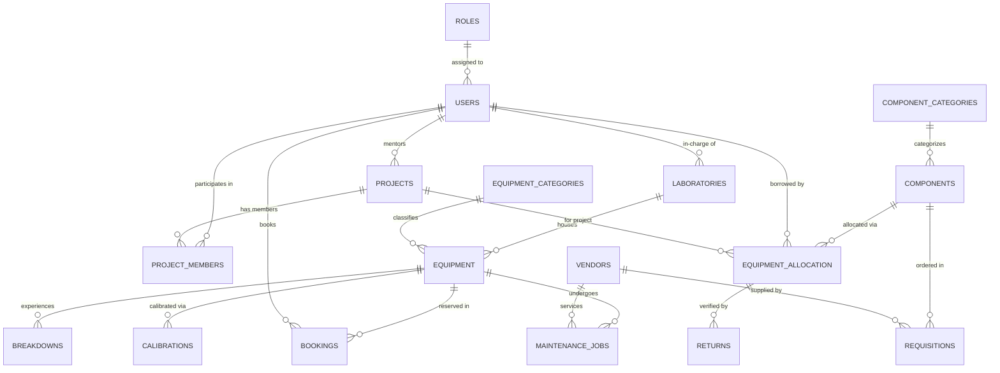

# RoboLab — Lab Management System

[](LICENSE)
[](https://www.python.org/)
[](https://palletsprojects.com/p/flask/)
[](database/)

A Flask web app for managing a robotics lab — equipment, component inventory, bookings, maintenance, calibrations, and student project tracking. Built as a DBMS PBL project.

Runs with MySQL. Falls back to SQLite automatically if MySQL isn't running.

---

## Table of Contents

1. [Features](#features)
2. [Roles](#roles)
3. [Tech Stack](#tech-stack)
4. [Database Schema](#database-schema)
5. [SQL Triggers](#sql-triggers)
6. [Setup](#setup)
7. [Project Structure](#project-structure)
8. [Changelog](#changelog)
9. [License](#license)

---

## Features

- **Dashboard** — Role-specific KPIs, recent activity, low-stock alerts, and a clean-slate onboarding banner.
- **Equipment** — Catalog of machines with status, location, and serial numbers. Per-equipment lifecycle timeline (bookings, breakdowns, maintenance).
- **Components** — Hardware inventory by category and bin location. Minimum stock threshold warnings.
- **Allocations** — Issue components to students per project. Return flow checks condition (`Good / Damaged / Burnt / Lost`) and triggers stock updates automatically.
- **Bookings** — Time-slot reservations for shared machines. States: `Pending → Approved → In Use → Returned`.
- **Maintenance** — Log faults with severity. Assign to vendor or in-house. Critical breakdowns auto-set equipment status to `Maintenance`.
- **Calibrations** — Due dates, certifying body, color-coded status: Overdue / Due Soon / OK.
- **Procurement** — Reorder suggestions when stock goes below minimum. Requisition tracked through approval and delivery.
- **Projects** — Capstone projects with faculty guides and student team members.
- **Reports** — Live SQL query runner for viva/review.
- **Users** — Self-register at `/register`. Admins manage roles at `/users`.
- **Demo Mode** — One-click sample data load, or reset to clean slate.

---

## Roles

| Role | Access |
|---|---|
| `Admin` | Everything — user management, procurement approvals, reports |
| `Lab Technician` | Issue/return components, log breakdowns, manage maintenance and calibrations |
| `Faculty` | Approve bookings, oversee projects |
| `Student` | Book slots, view issued components and project items |

Switch roles from the top nav bar (for testing).

---

## Tech Stack

- **Backend:** Python 3.10+, Flask 3.0+
- **Database:** MySQL 8.x with automatic SQLite 3 fallback
- **Frontend:** HTML/CSS/JS, dark theme, offline FontAwesome + Google Fonts
- **Config:** `python-dotenv`

---

## Database Schema

18 tables in 3NF.



| # | Table | Purpose |
|---|---|---|
| 1 | `ROLES` | Permission levels |
| 2 | `USERS` | All users |
| 3 | `LABORATORIES` | Lab rooms |
| 4 | `EQUIPMENT_CATEGORIES` | Equipment classification |
| 5 | `EQUIPMENT` | Machinery catalog |
| 6 | `COMPONENT_CATEGORIES` | Component classification |
| 7 | `COMPONENTS` | Hardware stock |
| 8 | `PROJECTS` | Academic projects |
| 9 | `PROJECT_MEMBERS` | Student-project mapping |
| 10 | `BOOKINGS` | Slot reservations |
| 11 | `EQUIPMENT_ALLOCATION` | Component loans |
| 12 | `RETURNS` | Return & inspection |
| 13 | `BREAKDOWNS` | Fault logs |
| 14 | `MAINTENANCE_JOBS` | Repair jobs |
| 15 | `VENDORS` | Suppliers |
| 16 | `CALIBRATIONS` | Calibration logs |
| 17 | `USAGE_LOGS` | Session logs |
| 18 | `REQUISITIONS` | Procurement orders |
| 19 | `NOTIFICATIONS` | Overdue/low-stock alerts |

---

## SQL Triggers

**1. Decrement stock on allocation**
```sql
CREATE TRIGGER trg_after_allocation_insert
AFTER INSERT ON EQUIPMENT_ALLOCATION FOR EACH ROW
BEGIN
    UPDATE COMPONENTS
    SET available_quantity = available_quantity - NEW.quantity
    WHERE component_id = NEW.component_id;
END;
```

**2. Restore stock on return**
```sql
CREATE TRIGGER trg_after_return_insert
AFTER INSERT ON RETURNS FOR EACH ROW
BEGIN
    DECLARE v_comp_id VARCHAR(20);
    SELECT component_id INTO v_comp_id
    FROM EQUIPMENT_ALLOCATION WHERE allocation_id = NEW.allocation_id;

    IF NEW.condition_status IN ('Good', 'Damaged') THEN
        UPDATE COMPONENTS
        SET available_quantity = available_quantity + NEW.returned_quantity
        WHERE component_id = v_comp_id;
    END IF;

    UPDATE EQUIPMENT_ALLOCATION
    SET status = 'Returned', actual_return_date = NEW.return_date
    WHERE allocation_id = NEW.allocation_id;
END;
```

**3. Set equipment to Maintenance on critical breakdown**
```sql
CREATE TRIGGER trg_after_breakdown_insert
AFTER INSERT ON BREAKDOWNS FOR EACH ROW
BEGIN
    IF NEW.severity IN ('High', 'Critical') THEN
        UPDATE EQUIPMENT SET status = 'Maintenance'
        WHERE equipment_id = NEW.equipment_id;
    END IF;
END;
```

---

## Setup

Requirements: Python 3.10+, Git. MySQL is optional.

```bash
git clone https://github.com/MSN-2007/Lab_Management-.git
cd Lab_Management-

python -m venv venv
venv\Scripts\activate        # Windows
# source venv/bin/activate   # Linux/macOS

pip install -r requirements.txt

cp .env.example .env         # edit if using MySQL

python app.py
```

Open `http://127.0.0.1:5000`.

If MySQL is not running, the app uses the pre-seeded `database/robolab.db` SQLite file automatically.

**MySQL (optional):**
```bash
mysql -u root -p < database/schema.sql
mysql -u root -p < database/seed.sql
```

---

## Project Structure

```
SQL_PBL/
├── app.py                  # Routes & context processors
├── config.py               # Environment config
├── db.py                   # DB layer (MySQL + SQLite fallback)
├── requirements.txt
├── .env.example
├── database/
│   ├── schema.sql          # Tables, views, triggers
│   ├── seed.sql            # Sample data
│   ├── queries.sql         # Viva query bank
│   └── robolab.db          # Pre-seeded SQLite file
├── static/
│   ├── css/style.css       # Dark theme
│   ├── js/main.js          # Modals, filters
│   └── webfonts/           # Bundled fonts & icons
└── templates/
    ├── layout.html
    ├── login.html
    ├── register.html
    ├── dashboard.html
    ├── equipment.html
    ├── equipment_detail.html
    ├── components.html
    ├── allocations.html
    ├── bookings.html
    ├── maintenance.html
    ├── calibrations.html
    ├── procurement.html
    ├── projects.html
    ├── reports.html
    ├── users.html
    ├── vendors.html
    └── profile.html
```

---

## Changelog

**Oct 2026**
- Simplified `equipment_detail.html` — removed redundant inline styles, cleaned up header and timeline markup
- `calibrations.html` — color-coded next-due-date by status
- `dashboard.html` — cleaner Student vs Staff view separation

---

## License

MIT — see [LICENSE](LICENSE).
