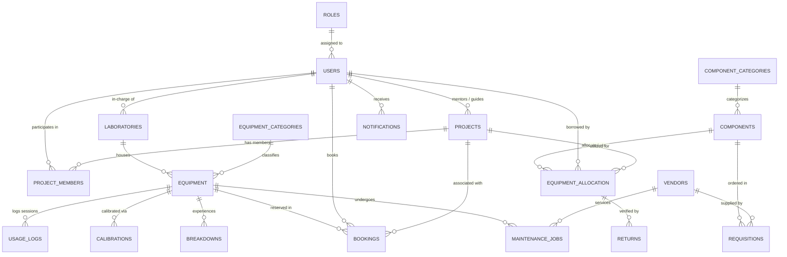

# 🤖 RoboLab: Robotics Laboratory Equipment, Component Booking & Maintenance Management System

[](LICENSE)
[](https://www.python.org/)
[](https://palletsprojects.com/p/flask/)
[](database/)
[](README.md)

> **RoboLab** is a comprehensive, production-ready, open-source database and laboratory operations platform engineered for academic makerspaces, university robotics labs, and advanced engineering institutions. It solves the critical operational bottlenecks of tracking hardware prototyping components, high-value shared robotics machinery, time-slot reservations, scheduled calibrations, breakdown maintenance, and student project allocations.

---

## 📋 Table of Contents

1. [🌟 Key Highlights & Innovations](#-key-highlights--innovations)
2. [✨ Detailed Feature Modules](#-detailed-feature-modules)
3. [👥 Role-Based Access Control & Demo Personas](#-role-based-access-control--demo-personas)
4. [🛠️ Technology Stack & System Architecture](#️-technology-stack--system-architecture)
5. [🗄️ Database Architecture & 3NF Relational Schema](#️-database-architecture--3nf-relational-schema)
6. [⚡ SQL Triggers & Automated Business Logic](#-sql-triggers--automated-business-logic)
7. [📊 Database Views & Viva Query Catalog](#-database-views--viva-query-catalog)
8. [⚙️ Installation & Quickstart Guide](#️-installation--quickstart-guide)
9. [📁 Project Directory Structure](#-project-directory-structure)
10. [🤝 Contributing](#-contributing)
11. [📄 License](#-license)

---

## 🌟 Key Highlights & Innovations

* 🎭 **Live Demo Showcase vs. Clean Slate Mode:** Instant 1-click launch with rich mock robotics lab data (equipment, components, bookings, breakdowns) for demonstrations, alongside an instant **"Reset to Clean Slate"** mode allowing users to create custom accounts and add real lab assets from scratch.
* 👤 **Self-Registration & User Assignment Portal:** Dedicated `/register` portal for users to create their own profiles across all roles (`Student`, `Faculty`, `Lab Technician`, `Admin`), alongside an administrative `/users` management interface to assign and edit roles.
* ⚡ **Dual-Engine Database Architecture:** Runs seamlessly with **MySQL 8.x** in production and features automatic zero-configuration fallback to **SQLite 3** for instant local evaluation.
* 🛡️ **3NF Normalized Relational Schema:** Strictly normalized across **18 interconnected relational tables**, complete with foreign key constraints, cascading rules, and ACID transaction guarantees.
* 🔄 **Automated Inventory Control Triggers:** Dynamic inventory stock decrement on component allocation and intelligent restocking upon quality-verified returns.
* 🔬 **Equipment Lifecycle & Incident Audit Trail:** Complete historical tracking of equipment breakdown incidents, vendor service jobs, metrology calibrations, and student usage logs.
* 📦 **Procurement & Low-Stock Requisition Engine:** Intelligent reorder recommendations with estimated budget calculations when stock breaches minimum safety thresholds.
* 🔌 **100% Offline-Ready Minimalist UI:** Zero external CDN dependencies. Bundled with local fonts (Google Outfit & Inter) and FontAwesome icon assets.
* 🎓 **Interactive DBMS Viva & SQL Query Explorer:** Built-in SQL lab review portal rendering raw queries, query execution plans, and multi-table result sets.

---

## ✨ Detailed Feature Modules

### 1. 📊 Executive & Role-Specific Dashboard
* High-level KPI counters: Total Equipment, Available Workstations, In-Maintenance Machinery, Active Student Allocations, and Active Projects.
* Real-time **Low Stock Shortage Banner** highlighting components that require immediate restock.
* Dynamic onboarding banner when operating in **Clean Slate Mode** with quick-action links to add equipment, components, or load sample showcase data.
* Role-tailored views displaying customized action items for Students, Faculty, and Lab Technicians.

### 2. 👤 Account Registration & User Role Management
* Public `/register` interface allowing new members to create accounts with custom department and roll/staff identifiers.
* Administrative `/users` directory with search, role filters, assignment modal, and activity counters (loans, bookings, projects).
* Personal `/profile` dashboard for managing contact info and viewing individual laboratory activity.

### 2. 🦾 High-Value Equipment Management
* Catalog for multi-axis robotic arms, 3D printers, CNC PCB routers, oscilloscopes, and ROS2 mobile robots.
* Complete equipment lifecycle tracking: serial numbers, purchase dates, warranty end dates, physical lab locations, and operational statuses (`Available`, `In Use`, `Maintenance`, `Decommissioned`).
* Detailed **Equipment Audit Timeline** linking historical breakdown tickets, vendor maintenance jobs, and slot reservations.

### 3. 📦 Component Inventory & Storage Bin Indexing
* Granular categorization (Sensors, Microcontrollers/SBCs, Actuators/Motors, Power Drivers, Consumables).
* Real-time stock counters: Total Quantity, Available Quantity, Minimum Safety Threshold, and Unit Cost.
* Physical storage bin assignment (e.g., `Bin B-03, Rack R-10`) for rapid hardware retrieval.

### 4. 🤝 Component Allocation & Return Quality Verification
* Issue prototyping components directly to students mapped to faculty-supervised academic projects.
* Due date monitoring with automated overdue calculation.
* Comprehensive **Return Verification Flow**: Inspects returned components with condition classification (`Good`, `Damaged`, `Burnt`, `Lost`) with automated stock adjustment triggers.

### 5. ⏱️ Equipment Slot Reservation & Approval Workflow
* Time-slot scheduling for high-demand machinery (6-DOF Robotic Arms, 3D Printers, Drone Flight Arenas).
* Conflict prevention and multi-stage booking lifecycle (`PENDING` ➔ `APPROVED` ➔ `IN_USE` ➔ `RETURNED` / `CANCELLED`).
* Faculty mentor & Lab In-charge approval controls.

### 6. 🔧 Maintenance Jobs & Incident Breakdown Tracking
* Detailed incident breakdown reporting with severity levels (`Low`, `Medium`, `High`, `Critical`).
* Automated equipment status updates to `Maintenance` upon critical breakdown registration.
* Job scheduling with vendor assignment or in-house technician allocation, problem diagnosis, action taken, and repair expense auditing.

### 7. 📐 Metrology & Scheduled Calibrations
* Equipment accuracy and safety compliance logging with calibration dates, certificate numbers, metrology agencies, and next due dates.
* Early warning alerts for equipment requiring recalibration.

### 8. 🛒 Procurement & Module Reorder Management
* Automated reorder recommendations calculated from minimum stock thresholds.
* Requisition pipeline (`Draft`, `Pending Approval`, `Approved`, `Ordered`, `Received`) with unit price estimation and cumulative budget calculations.

### 9. 🚀 Academic Projects & Student Team Mappings
* Centralized registry of capstone robotics projects, faculty mentors, department affiliations, and student team member assignments.

### 10. 📑 SQL Viva & Query Analytics Explorer
* Embedded query workbench executing live database queries for laboratory reviews:
  * 4-Way Relational JOINs (Student ➔ Project ➔ Component ➔ Category).
  * Equipment utilization aggregation with `GROUP BY` and `HAVING`.
  * Correlated subqueries and low-stock shortages.
  * Vendor cost analysis and metrology compliance audits.

---

## 👥 Role-Based Access Control & Demo Personas

RoboLab includes a **1-Click Quick Persona Switcher** in the top navigation bar to facilitate rapid testing and demonstration across all organizational roles:

| Persona | Name | Role | Email / Identifier | Department | Primary Permissions |
| :--- | :--- | :--- | :--- | :--- | :--- |
| **Admin** | Dr. Rajesh Sharma | `Admin` | `admin.rajesh@robolab.edu` / `STAFF001` | Robotics & Automation | Full system oversight, procurement approvals, user management, configuration. |
| **Lab Technician** | Vikram Verma | `Lab Technician` | `tech.vikram@robolab.edu` / `TECH002` | Robotics & Automation | Issue/return components, log breakdowns, manage maintenance jobs & calibrations. |
| **Faculty Mentor** | Dr. Ananya Iyer | `Faculty` | `faculty.ananya@robolab.edu` / `FAC003` | Electronics & Mechatronics | Approve equipment bookings, oversee student projects, review allocations. |
| **Student Borrower** | Sufiyan Khan | `Student` | `sufiyan.k@student.robolab.edu` / `RA21110030101` | Robotics Engineering | Request equipment slots, view allocated hardware, track project components. |

---

## 🛠️ Technology Stack & System Architecture

```
┌────────────────────────────────────────────────────────────────────────┐
│                              FRONTEND                                  │
│  HTML5 + Vanilla Modern CSS (Dark Theme) + Local FontAwesome 6.5       │
│  Offline Google Fonts (Outfit & Inter) + Responsive Modal System      │
└───────────────────────────────────┬────────────────────────────────────┘
                                    │ HTTP Requests / Jinja2 SSR
┌───────────────────────────────────▼────────────────────────────────────┐
│                           BACKEND ENGINE                               │
│  Python 3.10+ │ Flask 3.0+ │ Parameterized SQL Query Layer (db.py)     │
│  Session-Based RBAC Auth │ Context Processor Global Metrics           │
└───────────────────────────────────┬────────────────────────────────────┘
                                    │
            ┌───────────────────────┴───────────────────────┐
            ▼                                               ▼
┌───────────────────────────────┐               ┌───────────────────────────────┐
│     MySQL 8.x (Production)    │               │  SQLite 3 (Local Auto-Sync)   │
│  • Full ACID Transactions     │   Fallback    │  • Zero-configuration         │
│  • Native Triggers & Views    │ ────────────> │  • Self-contained DB file     │
│  • Multi-user Concurrency     │               │  • Immediate testing ready    │
└───────────────────────────────┘               └───────────────────────────────┘
```

* **Backend Framework:** Python Flask 3.0+
* **Database Drivers:** `mysql-connector-python` with automatic fallback to Python's built-in `sqlite3`
* **Configuration:** `python-dotenv` for environment isolation
* **Frontend Architecture:** Vanilla JavaScript, Modern Semantic HTML5, CSS custom properties design tokens

---

## 🗄️ Database Architecture & 3NF Relational Schema

The database schema is organized into **18 normalized entities (Third Normal Form - 3NF)** to eliminate data redundancy and preserve referential integrity:



### Table Reference Guide

| # | Table Name | Purpose & Cardinality | Key Attributes |
| :--- | :--- | :--- | :--- |
| 1 | `ROLES` | User permission levels | `role_id` (PK), `role_name`, `description` |
| 2 | `USERS` | Staff, faculty, and student registry | `user_id` (PK), `role_id` (FK), `full_name`, `email`, `roll_number` |
| 3 | `LABORATORIES` | Physical lab rooms & locations | `lab_id` (PK), `lab_name`, `location_code`, `incharge_id` (FK) |
| 4 | `EQUIPMENT_CATEGORIES` | Classification for machinery | `category_id` (PK), `category_name`, `description` |
| 5 | `EQUIPMENT` | High-value robotics machinery | `equipment_id` (PK), `category_id` (FK), `laboratory_id` (FK), `status`, `serial_number` |
| 6 | `COMPONENT_CATEGORIES` | Classification for prototyping parts | `category_id` (PK), `category_name`, `description` |
| 7 | `COMPONENTS` | Hardware inventory & stock levels | `component_id` (PK), `category_id` (FK), `total_quantity`, `available_quantity`, `minimum_stock` |
| 8 | `PROJECTS` | Academic capstone & research projects | `project_id` (PK), `faculty_guide_id` (FK), `project_name`, `status` |
| 9 | `PROJECT_MEMBERS` | Student-project association mapping | `member_id` (PK), `project_id` (FK), `user_id` (FK), `role_in_project` |
| 10 | `BOOKINGS` | Workstation time-slot reservations | `booking_id` (PK), `equipment_id` (FK), `user_id` (FK), `booking_date`, `status` |
| 11 | `EQUIPMENT_ALLOCATION` | Component loan records to students | `allocation_id` (PK), `component_id` (FK), `user_id` (FK), `project_id` (FK), `status` |
| 12 | `RETURNS` | Quality inspection & return audits | `return_id` (PK), `allocation_id` (FK), `condition_status`, `returned_quantity` |
| 13 | `BREAKDOWNS` | Equipment fault incident logs | `breakdown_id` (PK), `equipment_id` (FK), `reported_by` (FK), `severity`, `status` |
| 14 | `MAINTENANCE_JOBS` | Repair & maintenance job orders | `job_id` (PK), `equipment_id` (FK), `vendor_id` (FK), `cost`, `status` |
| 15 | `VENDORS` | Service partners & suppliers | `vendor_id` (PK), `vendor_name`, `contact_person`, `phone`, `rating` |
| 16 | `CALIBRATIONS` | Metrology compliance & calibration logs | `calibration_id` (PK), `equipment_id` (FK), `calibration_date`, `certificate_no` |
| 17 | `USAGE_LOGS` | Runtime & session telemetry logs | `log_id` (PK), `equipment_id` (FK), `user_id` (FK), `hours_used` |
| 18 | `REQUISITIONS` | Procurement orders for low stock | `requisition_id` (PK), `component_id` (FK), `quantity_requested`, `status` |
| 19 | `NOTIFICATIONS` | Alerts for low stock & overdue loans | `notification_id` (PK), `user_id` (FK), `title`, `message`, `is_read` |

---

## ⚡ SQL Triggers & Automated Business Logic

The system incorporates reactive triggers ensuring inventory integrity across concurrent operations:

### 1. Stock Decrement on Allocation (`trg_after_allocation_insert`)
```sql
CREATE TRIGGER trg_after_allocation_insert
AFTER INSERT ON EQUIPMENT_ALLOCATION
FOR EACH ROW
BEGIN
    UPDATE COMPONENTS
    SET available_quantity = available_quantity - NEW.quantity
    WHERE component_id = NEW.component_id;
END;
```

### 2. Stock Restoration on Verified Return (`trg_after_return_insert`)
```sql
CREATE TRIGGER trg_after_return_insert
AFTER INSERT ON RETURNS
FOR EACH ROW
BEGIN
    DECLARE v_comp_id VARCHAR(20);
    SELECT component_id INTO v_comp_id FROM EQUIPMENT_ALLOCATION WHERE allocation_id = NEW.allocation_id;
    
    -- Only restore usable stock if not destroyed
    IF NEW.condition_status IN ('Good', 'Damaged') THEN
        UPDATE COMPONENTS
        SET available_quantity = available_quantity + NEW.returned_quantity
        WHERE component_id = v_comp_id;
    END IF;
    
    UPDATE EQUIPMENT_ALLOCATION
    SET status = 'Returned', actual_return_date = NEW.return_date
    WHERE allocation_id = NEW.allocation_id;
END;
```

### 3. Equipment Status Shift on Breakdown (`trg_after_breakdown_insert`)
```sql
CREATE TRIGGER trg_after_breakdown_insert
AFTER INSERT ON BREAKDOWNS
FOR EACH ROW
BEGIN
    IF NEW.severity IN ('High', 'Critical') THEN
        UPDATE EQUIPMENT
        SET status = 'Maintenance'
        WHERE equipment_id = NEW.equipment_id;
    END IF;
END;
```

---

## 📊 Database Views & Viva Query Catalog

RoboLab includes pre-compiled relational views and complex queries ideal for academic evaluation:

* **`vw_active_allocations_overdue`**: Computes overdue duration in days via `DATEDIFF(CURRENT_DATE, expected_return_date)` joining 4 core entities.
* **`vw_low_stock_components`**: Evaluates `available_quantity <= minimum_stock` and computes immediate shortage quantities.
* **`vw_equipment_maintenance_history`**: Links maintenance expenditures, vendor information, and equipment downtime logs using `LEFT JOIN`.
* **`vw_booking_summary`**: Aggregates booking details with student, mentor, and approver metadata.

---

## ⚙️ Installation & Quickstart Guide

### Prerequisites
* **Python 3.10** or higher
* **Git**
* *(Optional)* **MySQL Server 8.0+** (if running with MySQL)

---

### Step 1: Clone the Repository
```bash
git clone https://github.com/MSN-2007/Lab_Management-.git
cd Lab_Management-
```

### Step 2: Create and Activate a Virtual Environment
```bash
# Windows (Command Prompt / PowerShell):
python -m venv venv
venv\Scripts\activate

# Linux / macOS:
python3 -m venv venv
source venv/bin/activate
```

### Step 3: Install Required Dependencies
```bash
pip install -r requirements.txt
```

### Step 4: Configure Environment Variables
Copy `.env.example` to `.env`:
```bash
cp .env.example .env
```

Edit `.env` if you wish to configure a custom MySQL database:
```ini
FLASK_DEBUG=True
SECRET_KEY=robolab-super-secret-key-2026

# MySQL Configuration
DB_HOST=localhost
DB_PORT=3306
DB_USER=root
DB_PASSWORD=your_password
DB_NAME=robotics_lab

# Dual-mode SQLite auto fallback (True by default)
AUTO_FALLBACK_SQLITE=True
```

> **Note on Zero-Config SQLite Mode:** If MySQL is not installed or running, RoboLab will automatically initialize the local `database/robolab.db` SQLite database with full sample data. You can start testing immediately without running any database setup commands!

---

### Step 5: (Optional) Initialize MySQL Database
If you are using MySQL:
```bash
# Log in to MySQL client and load schema & seed data
mysql -u root -p < database/schema.sql
mysql -u root -p < database/seed.sql
```

---

### Step 6: Launch the Web Application
```bash
python app.py
```
*(Or on Windows: `py app.py`)*

Open your browser and navigate to:
👉 **`http://127.0.0.1:5000`**

---

## 📁 Project Directory Structure

```
SQL_PBL/
├── app.py                      # Flask Application Controller, Routes & Context Processors
├── config.py                   # Global Configuration & Environment Variable Handler
├── db.py                       # Dual-Engine Database Abstraction Layer (MySQL & SQLite)
├── requirements.txt            # Python Dependencies Specification
├── .env.example                # Example Environment Configuration Template
├── CONTRIBUTING.md             # Developer Contribution Guidelines
├── CODE_OF_CONDUCT.md          # Community Code of Conduct
├── LICENSE                     # MIT Open-Source License
├── database/                   # Database Assets
│   ├── schema.sql              # Complete 3NF DDL Schema, Views, & Triggers (MySQL)
│   ├── seed.sql                # Production-Ready Realistic Robotics Sample Data
│   ├── queries.sql             # Curated DBMS Viva Review Query Bank
│   └── robolab.db              # Pre-seeded SQLite Embedded Database File
├── static/                     # Bundled 100% Offline Static Assets
│   ├── css/
│   │   └── style.css           # Modern Dark Theme Design System & Tokens
│   ├── js/
│   │   └── main.js            # Interactive Modals, Filtering & DOM Actions
│   └── webfonts/               # Offline FontAwesome & Typography Glyphs
└── templates/                  # Jinja2 Modular HTML Templates
    ├── layout.html             # Base Template with Navigation, Role Switcher & Alerts
    ├── login.html              # Authentication & 1-Click Role Login Portal
    ├── dashboard.html          # Executive & Role-Specific Overview
    ├── equipment.html          # Equipment Directory & Filters
    ├── equipment_detail.html   # Equipment Lifecycle, Breakdown & Service Timeline
    ├── components.html         # Component Inventory & Low-Stock Alerts
    ├── allocations.html        # Student Loans & Return Quality Verification Modal
    ├── bookings.html           # Time-Slot Reservation & Approval Management
    ├── maintenance.html        # Breakdown Logging & Vendor Service Scheduling
    ├── calibrations.html       # Metrology & Calibration Certificate Compliance
    ├── procurement.html        # Low-Stock Reorder Recommendations & Requisitions
    ├── projects.html           # Capstone Robotics Projects & Student Teams
    ├── reports.html            # Interactive SQL Viva Query Reports Explorer
    └── vendors.html            # Equipment Supplier & Service Partner Directory
```

---

## 🤝 Contributing

Contributions, bug reports, and feature suggestions are warmly welcomed! Please read our [CONTRIBUTING.md](CONTRIBUTING.md) for branch naming conventions, code standards, and PR guidelines.

---

## 📄 License

This project is licensed under the **MIT License** — see the [LICENSE](LICENSE) file for details.
